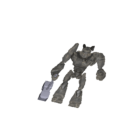

# Image recognition by DNN and CNN
Simple Deep neural networks and Convolutional Neural Networks used to recognise 2D images of deformed objects generated with Houdini.

[Details](recognise_images.ipynb)