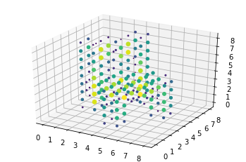
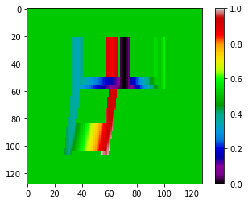
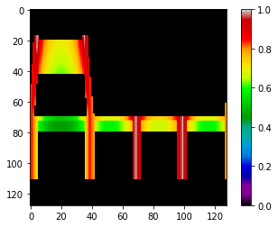
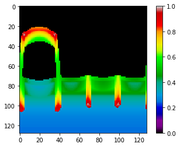
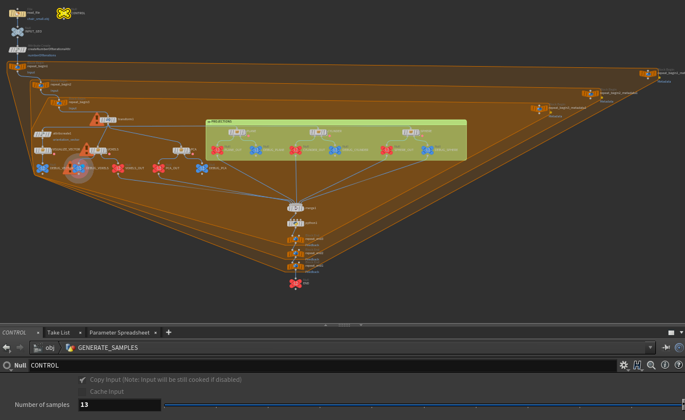
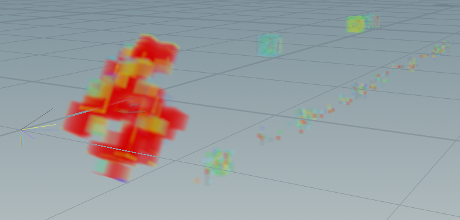
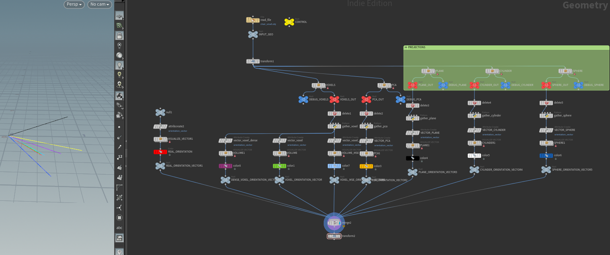

# Image recognition by DNN and CNN
Simple Deep neural networks and Convolutional Neural Networks used to recognise 2D images of deformed objects generated with Houdini.

[Details](recognise_images.ipynb)

Few different representations of objects ware gathered to determinate which will work the best:
* Voxels

* Projection on plane (distance from plane surface)

* Projection on cylinder

* Projection on sphere

# Visualisation of filters
To understand networks a little bit better I created a visualization of filters and activations:

It's in `/obj/visualize_filters` of [recreate_pivot_volume.hiplc](recreate_pivot_volume.hiplc)

# Testing
Test is in `/obj/test` of [recreate_pivot_volume.hiplc](recreate_pivot_volume.hiplc)

Colored lines on the right part of this screenshot represent orientations predicted by different networks.