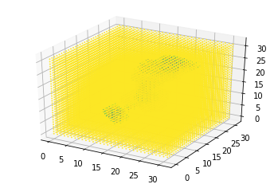
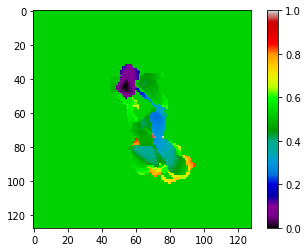
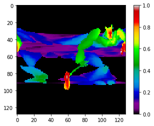
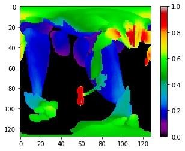
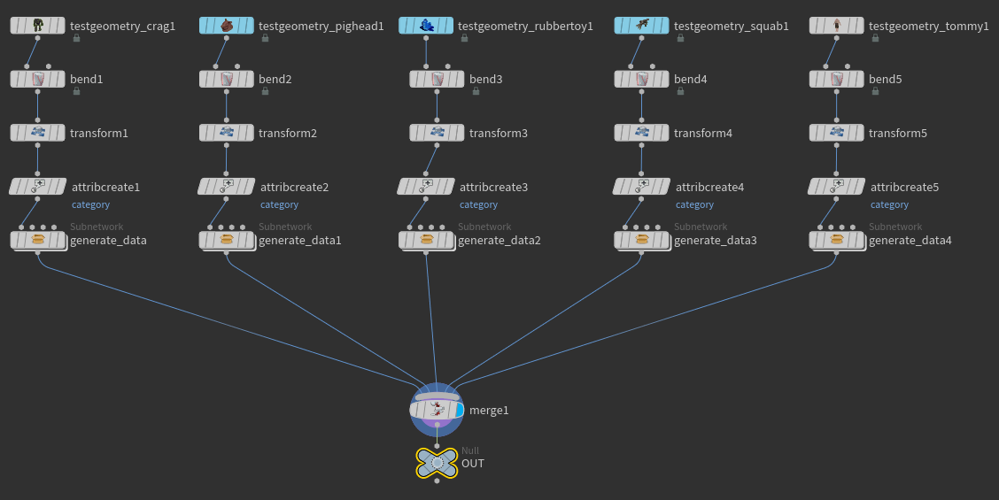
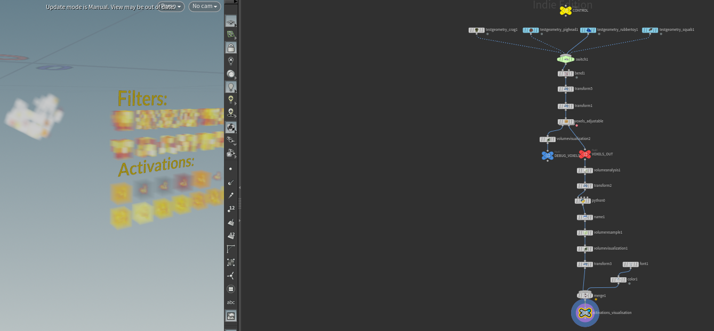
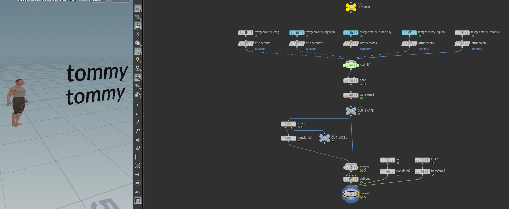
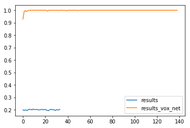

# 3D objects recognition by DNN and CNN
Simple Deep neural networks and Convolutional Neural Networks used to recognize deformed 3D objects generated with Houdini.

[Details](recreating_pivot_learning.ipynb)

Few different representations of objects ware gathered to determinate which will work the best:
* Voxels

* Projection on plane (distance from plane surface)

* Projection on cylinder

* Projection on sphere

## Visualisation of filters
To understand networks a little bit better I created a visualization of filters and activations:

It's in `/obj/visualize_filters` of [generate_data_18.hiplc](generate_data_18.hiplc)

## Testing
Test is in `/obj/test` of [generate_data_18.hiplc](generate_data_18.hiplc)

## Notes
The simple network did not perform well. I've compared it to a network modeled after [VoxNet](https://github.com/SnowMasaya/Generative-and-Discriminative-Voxel-Modeling-Keras/tree/master/src) and although differences in network architectures are not that big, the difference in results is great:

### Deep dreaming 
I've tried to use the logic of [Google deep dreaming](https://deepdreamgenerator.com/) to create some nice effects by running it on some randomly generated clouds, but, unfortunately, the effect does not look nice at all:

Maybe There's something I'm not doing right, or maybe networks are too simple and filters are not interesting enough. Anyway, this gives some more deep understanding of how neural networks work and how Keras can be used, so to use this deep dreaming implementation:
* Generate data with [deep_dream.py](deep_dream.py) 
* Visualize data with [cloud.hpilc](cloud.hpilc)

### TODO
I should try running this deep dreaming implementation with a trained VoxNet network.
