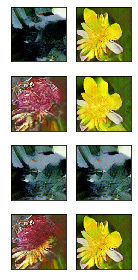
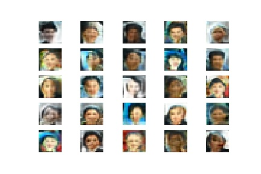

# GANs and VACs
Implementation of Generative adversarial network and Variable Auto Encoder, for image generation.

[Details](generative_networks.ipynb)

[Live demo](http://pkowalski.com/flowers_demo/)

# ProGAN
Implementation of Progressive Gan, more stable approach to generation of images

[Details](progan.ipynb)
