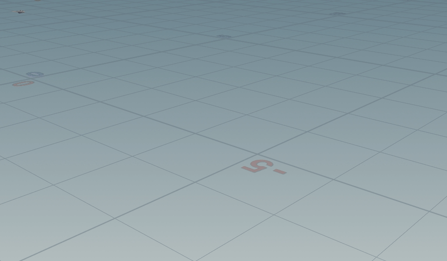

# Keras & Houdini - Deep Neural Networks and 3D
This repository is a collection of my personal projects on Deep Neural Networks usage in working with 3D data - Keras & Houdini:
* [Recognizing 2D renders](1_recognise_images)
* [Guessing the orientation of 3D objects](2_recreate_pivot)
* [Recognizing 3D objects](3_recognize_objects)
* [Simulation of a paper plane flight](4_plane)



## Prerequisites
### Windows
On Windows Keras cannot use Tensorflow as backend in Python 2.7 but Caffe can be used instead. 
With this said, I worked mostly on Linux, so some other problems that I did not encounter may appear.

### Linux
Houdini uses a different version of HDF5 library then Keras does. This causes Houdini to crash on model loading or saving. To prevent this HDF5 for houdini can be compiled and replaced by hand.

Download a right version of HDF5 and h5py: [H5py 2.9.0](https://github.com/h5py/h5py/releases/tag/2.9.0) [HDF5 1.8.11](https://support.hdfgroup.org/ftp/HDF5/releases/hdf5-1.8/hdf5-1.8.11/obtain51811.html)
Download get_pip to install pip in Houdini:
[get_pip](https://www.google.com/url?sa=t&rct=j&q=&esrc=s&source=web&cd=1&ved=2ahUKEwiopojo4LXmAhWIAhAIHY6FDmkQFjAAegQIARAB&url=https%3A%2F%2Fbootstrap.pypa.io%2Fget-pip.py&usg=AOvVaw0zKVO_zW0nkF7s0zdjWFNj)

* Install pip and set your user as owner of Pyhton directory that Houdini uses:
```
/opt/hfs18.0.287/python/bin/python get-pip.py
udo chown USERNAME -R /opt/hfs18.0.287/python/
```
* Due to https://github.com/keras-team/keras/issues/13353 run:
```
/opt/hfs18.0.287/python/bin/python -m pip install pkgconfig
```
* Install Keras and Tensorflow from pip
```
/opt/hfs18.0.287/python/bin/python -m pip install keras==2.2.5
/opt/hfs18.0.287/python/bin/python -m pip install tensorflow==1.15
```
* Compile and install HDF5, e.g.
```
/opt/hfs18.0.287/python/bin/python setup.py configure --hdf5-version=1.8.11 --hdf5=/home/pawel/git/hdf5-1.8.11-linux-x86_64-shared
/opt/hfs18.0.287/python/bin/python setup.py install
```
